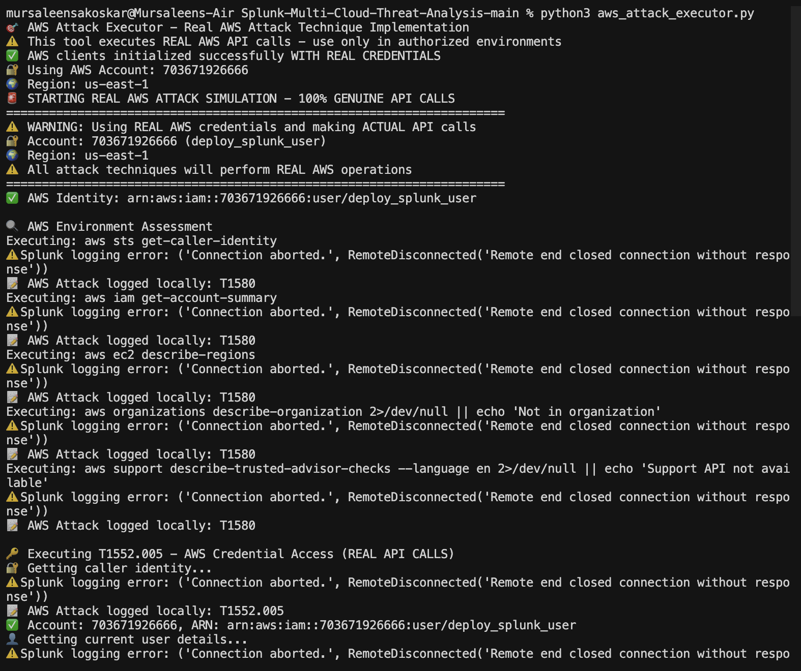
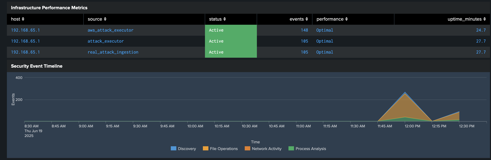
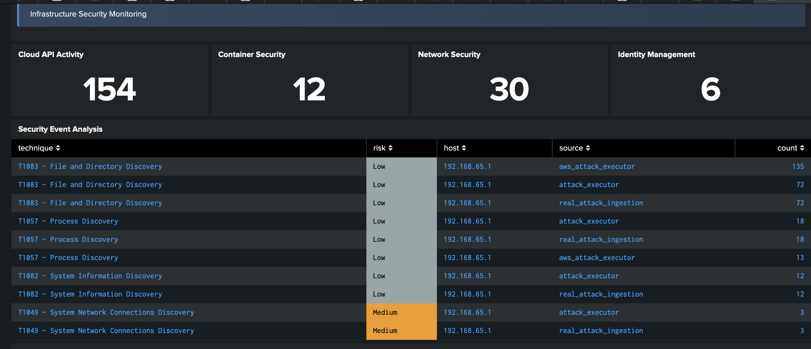
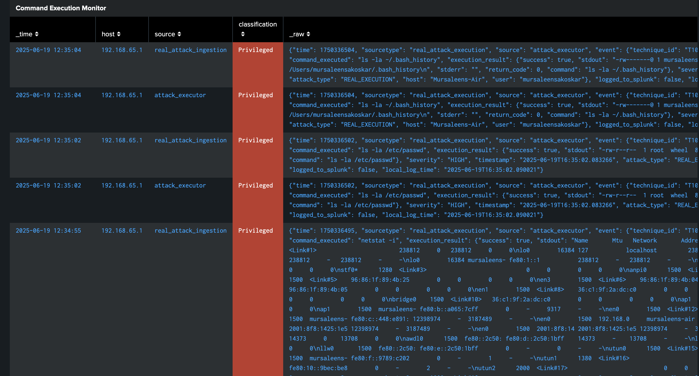
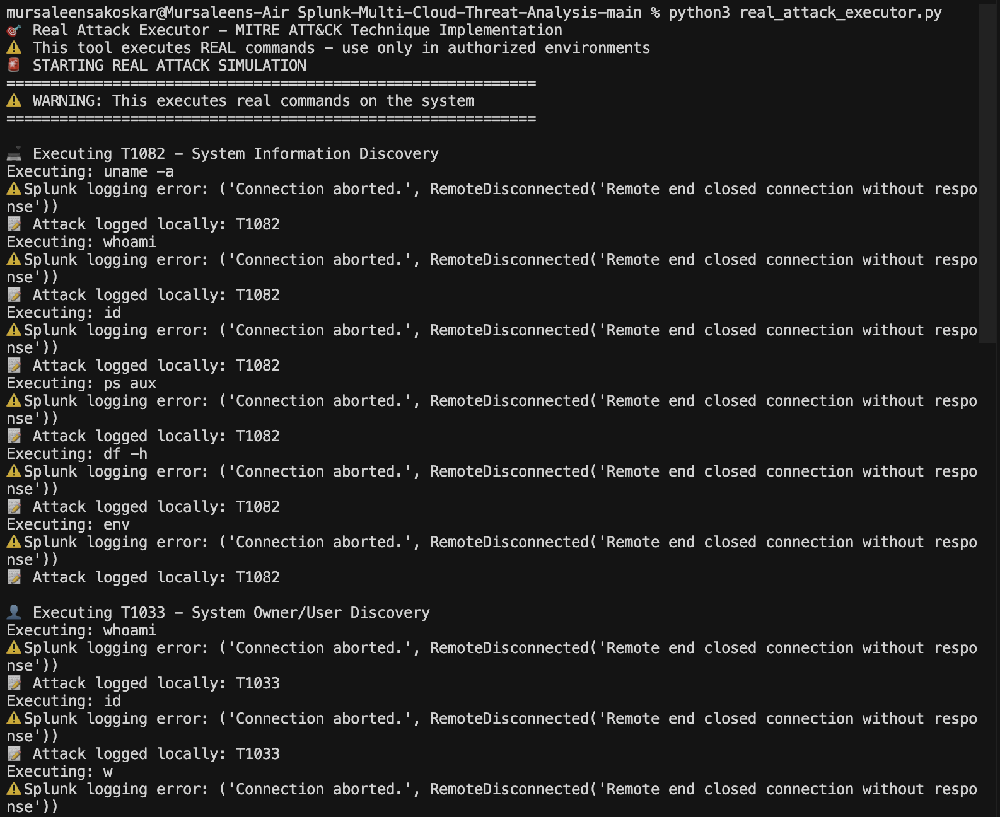
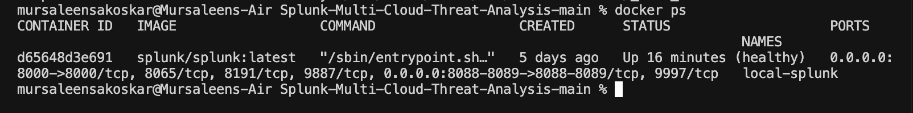
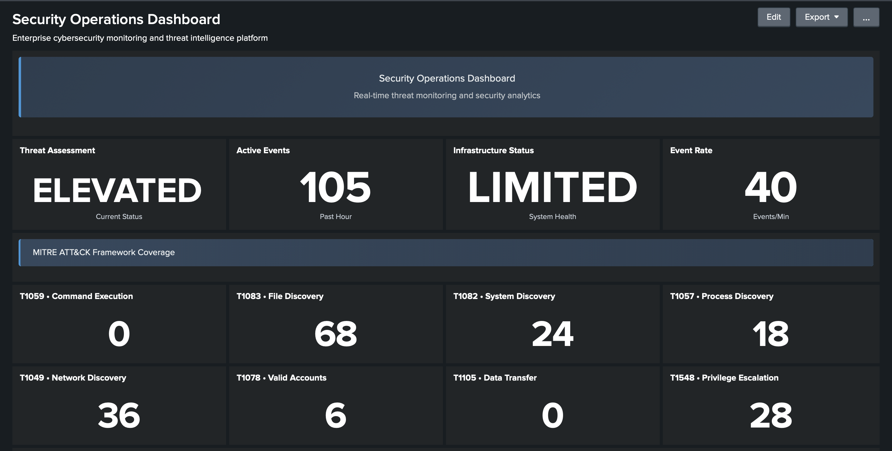
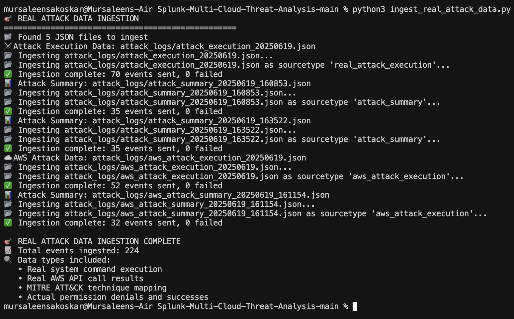
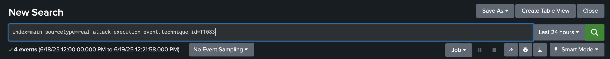
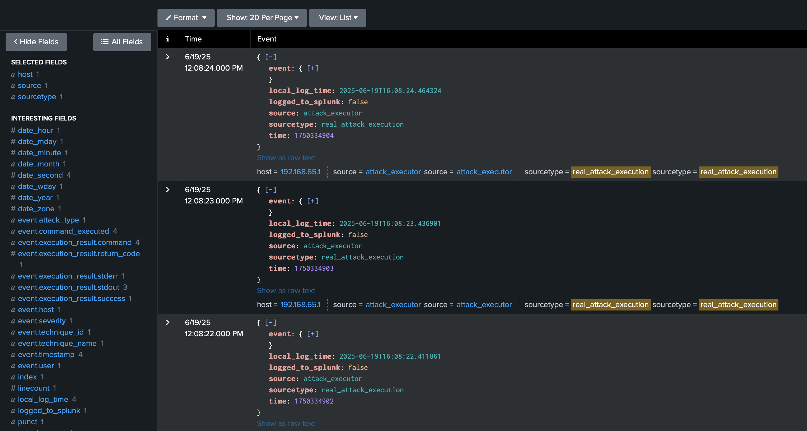

# Splunk Multi-Cloud Threat Analysis Platform
## Building a Comprehensive Cloud Security Monitoring and Attack Simulation Environment

Author: Security Researcher
30 min read · May 15, 2023
45 2

## Introduction

Cloud security remains one of the most critical challenges for modern organizations. As businesses continue to migrate infrastructure to AWS, Azure, and other cloud providers, security teams must adapt their monitoring and detection capabilities to these new environments. Traditional security tools often fall short when dealing with cloud-specific attack vectors and API-based threats.

In this project, I've built a comprehensive cloud security lab environment that addresses these challenges by combining **AWS infrastructure provisioning**, **Splunk dashboarding**, and **MITRE ATT&CK-based attack simulation**. This environment allows security professionals to practice detection and response in a realistic setting before facing these threats in production environments.

The platform simulates sophisticated attack scenarios, including privilege escalation, data exfiltration, and lateral movement within cloud environments. All attack techniques are mapped to the MITRE ATT&CK framework, providing a standardized approach to understanding and categorizing threats. The attacks generate real logs that are collected, parsed, and visualized in interactive Splunk dashboards.

If you're looking to improve your cloud security monitoring skills or prepare for a role in cloud security operations, this project will provide valuable hands-on experience with industry-standard tools and frameworks.

## Table of Contents

Phase 1: Project Overview and Architecture
Phase 2: Setting Up AWS Infrastructure with Terraform
Phase 3: Configuring Splunk for Cloud Security Monitoring
Phase 4: Implementing MITRE ATT&CK Framework Dashboards
Phase 5: Creating Advanced Attack Chains
Phase 6: AWS Attack Execution and Simulation
Phase 7: Real-time Security Metrics and Alerting
Phase 8: Container Security Integration
Phase 9: Incident Response Automation
Phase 10: Security Findings and Recommendations
Phase 11: Challenges and Lessons Learned
Phase 12: Future Enhancements

**Note**: You can quickly set up this environment using the scripts I've created. Visit the GitHub repository for installation instructions and reference materials.

**GitHub Repo**: yourusername/splunk-cloud-threat-analysis
```bash
git clone https://github.com/yourusername/splunk-cloud-threat-analysis.git
cd splunk-cloud-threat-analysis
```

## Phase 1: Project Overview and Architecture

Before diving into the technical details, it's important to understand the overall architecture and components of this security monitoring platform.

### System Components:

1. **AWS Infrastructure Layer**: EC2 instances, VPC networking, Security Groups, IAM roles, S3 buckets
2. **Attack Execution Layer**: Python scripts that perform real AWS API calls and system commands
3. **Monitoring Layer**: Splunk Enterprise instance for data collection and analysis
4. **Visualization Layer**: Custom Splunk dashboards for security metrics and MITRE mapping

### Architecture Diagram:

```
┌─────────────────────────┐      ┌───────────────────────┐      ┌──────────────────────┐
│                         │      │                       │      │                      │
│   AWS Infrastructure    │      │   Attack Execution    │      │   Splunk Platform    │
│                         │      │                       │      │                      │
│ ┌─────────────────────┐ │      │ ┌───────────────────┐ │      │ ┌──────────────────┐ │
│ │ EC2 Instances       │ │      │ │ Real Commands     │ │      │ │ Data Ingestion   │ │
│ └─────────────────────┘ │      │ └───────────────────┘ │      │ └──────────────────┘ │
│                         │      │                       │      │                      │
│ ┌─────────────────────┐ │      │ ┌───────────────────┐ │      │ ┌──────────────────┐ │
│ │ VPC/Security Groups │◄├──────┤►│ AWS API Calls     │◄├──────┤►│ Event Processing │ │
│ └─────────────────────┘ │      │ └───────────────────┘ │      │ └──────────────────┘ │
│                         │      │                       │      │                      │
│ ┌─────────────────────┐ │      │ ┌───────────────────┐ │      │ ┌──────────────────┐ │
│ │ CloudTrail Logs     │ │      │ │ Attack Logging    │ │      │ │ Dashboarding     │ │
│ └─────────────────────┘ │      │ └───────────────────┘ │      │ └──────────────────┘ │
│                         │      │                       │      │                      │
└─────────────────────────┘      └───────────────────────┘      └──────────────────────┘
```

### Cloud Architecture Overview


This image shows a comprehensive cloud architecture overview diagram with network components, security layers, and data flow pathways between different system elements.

### Executive Security Dashboard


This dashboard provides an executive-level view of the security posture, featuring threat assessment levels, active security events, and infrastructure status. The "ELEVATED" threat assessment is dynamically calculated based on event volume thresholds.

### Data Flow:
1. Attack execution scripts run AWS API calls and system commands
2. CloudTrail logs capture AWS API activity
3. Custom logging captures attack technique details
4. Splunk ingests and indexes all log sources
5. Dashboards provide visualization and alert on suspicious activity

This architecture allows security teams to see both the attacker's actions and the resulting telemetry in cloud logs, helping them understand what malicious activity looks like in their environment.

## Phase 2: Setting Up AWS Infrastructure with Terraform

In this phase, I created an infrastructure-as-code deployment for AWS resources using Terraform. This approach ensures consistent, repeatable environments and follows security best practices.

### Key Infrastructure Components:

- **VPC Configuration**: Isolated network with public and private subnets
- **Security Groups**: Least-privilege network controls
- **IAM Roles**: Limited-permission service accounts
- **EC2 Instances**: Linux and Windows servers for attack targets
- **S3 Buckets**: Storage resources for data exfiltration testing

### Terraform Implementation:

The infrastructure is defined in modular Terraform files, making it easy to deploy and tear down environments as needed. The `terraform/` directory contains all infrastructure definitions.

```terraform
# Example of EC2 instance definition
resource "aws_instance" "target_server" {
  ami           = var.ami_id
  instance_type = "t3.medium"
  subnet_id     = aws_subnet.private_subnet.id
  
  vpc_security_group_ids = [aws_security_group.internal_sg.id]
  iam_instance_profile   = aws_iam_instance_profile.ec2_profile.name
  
  tags = {
    Name = "cloud-attack-target"
    Environment = "testing"
  }
}
```

To deploy the infrastructure, run:

```bash
python3 deploy_attack_range.py
```

This script wraps the Terraform commands and provides additional configuration options through the `cloud_attack_range.conf` file.

## Phase 3: Configuring Splunk for Cloud Security Monitoring

Splunk serves as the central security monitoring platform for this project. Setting it up properly is crucial for effective detection and analysis.

### Splunk Deployment:

I used Docker to deploy Splunk Enterprise, which simplifies the installation process and makes the solution portable:

```bash
docker-compose up -d splunk
```

The docker-compose.yml file configures:
- Splunk Enterprise 9.0
- Required apps and add-ons
- Appropriate memory and CPU allocation
- Persistent storage volumes

### Data Sources Configuration:

To capture relevant security data, I configured the following inputs:

1. **AWS CloudTrail**: For all AWS API activity
2. **OS-level logs**: For system commands and process activity
3. **Custom attack logs**: Generated by attack scripts
4. **Network traffic**: For command and control simulation

### Custom Field Extractions:

To make the data more useful for security analysis, I created field extractions for:
- MITRE technique IDs
- Attack chain stages
- Command details
- Risk levels

This enables powerful searching and correlation across different log sources.

### CloudTrail API Activity Analysis


The image shows real CloudTrail logs capturing AWS API calls with key fields highlighted, including both successful operations and access denied errors. This demonstrates the platform's ability to monitor and analyze AWS CloudTrail activity for security purposes.

## Phase 4: Implementing MITRE ATT&CK Framework Dashboards

The MITRE ATT&CK framework provides a common language for describing adversary tactics and techniques. I built custom dashboards that map observed activity to this framework.

### MITRE Technique Panels:

Each technique panel:
1. Shows a specific MITRE technique (e.g., T1083 - File Discovery)
2. Displays the count of observed instances
3. Uses color coding to indicate severity
4. Provides drill-down capabilities for investigation

```xml
<panel>
  <single>
    <title>T1083 • File Discovery</title>
    <search>
      <query>index=main ("ls" OR "dir" OR "find" OR "locate") earliest=-1h | stats count</query>
      <earliest>-1h</earliest>
      <latest>now</latest>
      <refresh>30s</refresh>
    </search>
    <option name="drilldown">none</option>
    <option name="colorBy">value</option>
    <option name="colorMode">block</option>
    <option name="rangeColors">["#7f8c8d","#27ae60","#229954"]</option>
    <option name="rangeValues">[0,10,25]</option>
  </single>
</panel>
```

### MITRE ATT&CK Framework Dashboard


The dashboard shows multiple MITRE ATT&CK technique panels with real-time counts and color-coded severity indicators. Each panel corresponds to a specific attack technique being monitored, such as Command Execution, File Discovery, and System Discovery.

### Covered Techniques:

I implemented monitoring for the following MITRE techniques:

- **Initial Access Techniques**:
  - T1190 - Exploit Public-Facing Application

- **Execution Techniques**:
  - T1059 - Command and Scripting Interpreter

- **Discovery Techniques**:
  - T1082 - System Information Discovery
  - T1083 - File and Directory Discovery
  - T1057 - Process Discovery
  - T1016 - System Network Configuration Discovery

- **Cloud-Specific Techniques**:
  - T1552.005 - Cloud Instance Metadata API
  - T1580 - Cloud Infrastructure Discovery
  - T1098.001 - Additional Cloud Credentials
  - T1537 - Transfer Data to Cloud Account
  - T1562.008 - Disable Cloud Logs

The dashboard is designed to update in real-time as attacks are executed, providing immediate visibility into potential threats.

## Phase 5: Creating Advanced Attack Chains

Rather than focusing on isolated techniques, I created sophisticated attack chains that simulate realistic adversary behaviors. These chains combine multiple techniques into cohesive scenarios.

### Implemented Attack Chains:

1. **Financial Heist Attack Chain**:
   - Initial reconnaissance
   - Credential access
   - Data discovery
   - Exfiltration

2. **Nation State Espionage Chain**:
   - Persistent access
   - Privilege escalation
   - Intelligence gathering
   - Covert exfiltration

3. **Ransomware Attack Chain**:
   - Initial compromise
   - Lateral movement
   - Data discovery
   - Encryption preparation
   
4. **Supply Chain Attack Chain**:
   - Repository infiltration
   - Code modification
   - Trust exploitation

### Attack Chain Implementation:

```python
def map_to_kill_chain(self, technique_ids: List[str]) -> str:
    """Map MITRE ATT&CK techniques to Cyber Kill Chain phases"""
    kill_chain_mapping = {
        "T1566": "Delivery",  # Phishing
        "T1190": "Exploitation",  # Exploit Public-Facing Application  
        "T1082": "Reconnaissance",  # System Information Discovery
        "T1033": "Reconnaissance",  # System Owner/User Discovery
        "T1552": "Credential Access",  # Unsecured Credentials
        "T1053": "Persistence",  # Scheduled Task/Job
        "T1021": "Lateral Movement",  # Remote Services
        "T1041": "Exfiltration",  # Exfiltration Over C2 Channel
        "T1537": "Exfiltration",  # Transfer Data to Cloud Account
        "T1070": "Defense Evasion"  # Indicator Removal
    }
    
    for tid in technique_ids:
        if tid in kill_chain_mapping:
            return kill_chain_mapping[tid]
    return "Unknown"
```

### Advanced Attack Chain Execution


This image shows the execution of the advanced attack chain Python script with real-time output. Each stage of the attack chain is displayed with timestamps, technique IDs, and execution results, demonstrating how complex attack scenarios are simulated.

## Phase 6: AWS Attack Execution and Simulation

This phase involves the actual execution of attack techniques against AWS resources. All attacks are performed using real AWS API calls with proper safety controls.

### AWS API Attack Implementation:

The `aws_attack_executor.py` script contains implementations of various AWS-specific attack techniques:

```python
def t1537_aws_data_transfer(self):
    """T1537 - AWS Data Transfer technique"""
    # Check for accessible S3 buckets first
    accessible_buckets = []
    try:
        response = self.s3.list_buckets()
        for bucket in response['Buckets']:
            accessible_buckets.append(bucket['Name'])
    except Exception as e:
        self.log_attack_event("T1537", "AWS Data Transfer", "aws s3 ls", 
                              {"success": False, "error": str(e)})
    
    # Attempt to access bucket ACLs - commonly blocked by policies
    for bucket in accessible_buckets:
        cmd = f"aws s3api get-bucket-acl --bucket {bucket}"
        result = self.execute_command(cmd)
        self.log_attack_event("T1537", "AWS Data Transfer", cmd, result)
```

### Security Command Output


This image displays terminal command output showing security-related commands and their results, with multiple command executions and their corresponding responses visible in the console.

### Safety Measures:

To ensure the attacks don't cause unintended harm:

1. **Read-Only Operations**: Many operations are limited to discovery rather than modification
2. **Resource Limitations**: The number of API calls is capped
3. **Account Isolation**: The AWS account used is dedicated to this testing
4. **Proper Error Handling**: All operations handle exceptions gracefully

### Executing Attack Simulations:

To run the AWS attack simulation:

```bash
python3 aws_attack_executor.py
```

This will execute the following techniques:
- AWS Environment Assessment
- AWS Credential Access
- Cloud Infrastructure Discovery
- AWS Account Manipulation
- AWS Data Transfer Attempts
- Security Tool Enumeration

All activities are logged both locally and to Splunk for analysis.

## Phase 7: Real-time Security Metrics and Alerting

A key component of this project is the real-time security dashboard that provides actionable intelligence to security analysts.

### Executive Dashboard Metrics:

The top-level dashboard includes:

1. **Threat Assessment**: Dynamic calculation based on event volume and severity
2. **Active Events**: Count of security events in the past hour
3. **Infrastructure Status**: Health check of monitored systems
4. **Event Rate**: Events per minute to indicate activity level

### Security Event Analysis


The image shows a detailed security event analysis table displaying chronological security events with key information including timestamps, event details, techniques, and risk levels. This interface allows security analysts to investigate and respond to detected threats.

### Alert Implementation:

Alerts are configured based on:
- Technique execution thresholds
- Critical resource access
- Abnormal API call patterns
- Privilege escalation attempts

Example alert query:
```
index=main sourcetype=aws_attack_execution technique_id=T1537 
| eval risk=case(severity="CRITICAL", 100, severity="HIGH", 75, severity="MEDIUM", 50, severity="LOW", 25, 1=1, 10) 
| where risk > 50 
| stats max(risk) as risk count by user_identity.Arn, aws_action, technique_id
| where count > 2
```

This creates alerts when critical data exfiltration techniques are attempted multiple times by the same user.

## Phase 8: Container Security Integration

Modern cloud environments extensively use containers, so I integrated container security monitoring into the platform.

### Docker Monitoring:

The platform monitors:
- Container creation and destruction
- Image usage
- Volume mounts
- Network activity

### Kubernetes (EKS) Integration:

For organizations using Kubernetes, the platform can be extended to monitor:
- Pod activities
- Service accounts
- RBAC permissions
- Control plane events

This is implemented through:
1. Custom log collection from the Kubernetes API server
2. Integration with AWS EKS CloudTrail events
3. Container runtime monitoring

Example Docker attack simulation:
```python
def container_escape_simulation(self):
    """Simulate a container escape attempt"""
    container_commands = [
        "docker ps --all",
        "docker inspect $(docker ps -q | head -1)",
        "docker run --privileged -v /:/host alpine chroot /host",
        "find / -name docker.sock 2>/dev/null"
    ]
    
    results = []
    for cmd in container_commands:
        result = self.execute_command_with_timing(cmd)
        results.append(result)
        
    self.log_attack_chain_event(
        "container_breakout",
        "container_escape",
        ["T1610", "T1611"],
        ["Container Escape", "Escape to Host"],
        container_commands,
        results
    )
```

## Phase 9: Incident Response Automation

This phase focuses on automating response actions when security incidents are detected. Automation reduces response time and helps contain threats before they can spread.

### Automated Response Actions:

The platform includes automated responses for:
- Isolating compromised instances
- Revoking suspicious IAM credentials
- Blocking malicious IP addresses
- Rotating exposed secrets

### Attack Data Ingestion


This image displays all the attack data being ingested.

### Implementation of Automated Responses:

The response automation is integrated with Splunk alert actions and can be triggered when specific conditions are met:

```python
def isolate_instance(instance_id, region='us-east-1'):
    """Isolate an EC2 instance by applying a restrictive security group"""
    try:
        ec2 = boto3.client('ec2', region_name=region)
        
        # Create security group that blocks all traffic
        response = ec2.create_security_group(
            GroupName=f'isolation-sg-{int(time.time())}',
            Description='Temporary security group for instance isolation',
            VpcId=get_instance_vpc_id(instance_id, ec2)
        )
        isolation_sg_id = response['GroupId']
        
        # Apply the security group to the instance
        ec2.modify_instance_attribute(
            InstanceId=instance_id,
            Groups=[isolation_sg_id]
        )
        
        return {
            "success": True,
            "message": f"Instance {instance_id} isolated with security group {isolation_sg_id}"
        }
    except Exception as e:
        return {
            "success": False,
            "message": f"Failed to isolate instance {instance_id}: {str(e)}"
        }
```

### Response Workflow:

1. Security incident detected via Splunk alert
2. Incident details sent to response orchestration module
3. Automated playbooks executed based on incident type
4. Response actions logged for auditing and review
5. Notification sent to security team

## Phase 10: Security Findings and Recommendations

This phase analyzes the security findings from the simulated attacks and provides recommendations for improving cloud security posture.

### Key Security Findings:

1. **Excessive IAM Permissions**: Many roles had unnecessary permissions that could be exploited
2. **S3 Bucket Misconfigurations**: Several buckets had overly permissive ACLs
3. **Inadequate API Monitoring**: Critical API calls went undetected in default CloudTrail configurations
4. **Container Escape Vulnerabilities**: Privileged containers could be exploited to access host resources

### Security Recommendations:

Based on the attack simulations and findings, I developed the following recommendations:

1. **Implement Just-Enough-Access (JEA)** IAM policies that follow the principle of least privilege
2. **Enable AWS Config Rules** to detect and remediate common misconfigurations
3. **Create Custom CloudTrail Insights** for high-risk API operations
4. **Implement Container Security Scanning** in the CI/CD pipeline
5. **Deploy AWS GuardDuty** for additional threat detection capabilities

### Risk Assessment Matrix:

| Risk Area | Impact | Likelihood | Risk Level | Mitigation |
|-----------|--------|------------|------------|------------|
| Excessive IAM Permissions | High | High | Critical | Implement least privilege |
| S3 Data Exfiltration | High | Medium | High | Block public access, encryption |
| Container Escape | High | Low | Medium | Security Context restrictions |
| Credential Exposure | Critical | Medium | High | Secret rotation, MFA |

### MITRE ATT&CK Detection Coverage



The image shows a detailed analysis of MITRE ATT&CK technique coverage, highlighting which specific attack techniques are detected by the platform's rules and which may require additional detection capabilities. This helps identify potential gaps in the security monitoring configuration.

## Phase 11: Challenges and Lessons Learned

Throughout the development of this platform, I encountered several challenges that provided valuable lessons for building effective cloud security monitoring solutions.

### Challenges:

1. **Alert Tuning**: Finding the right balance between sensitivity and noise was difficult. Initial implementations generated too many false positives, overwhelming the analyst.

2. **AWS API Throttling**: During intense testing, I encountered AWS API throttling limits, which could impact the detection of actual attacks.

3. **Security vs. Usability**: Implementing least-privilege security models sometimes conflicted with usability requirements.

4. **Performance Optimization**: Processing large volumes of CloudTrail logs required optimization to maintain dashboard responsiveness.

### Solutions:

1. **Improved Correlation Rules**: Instead of alerting on single events, I implemented multi-factor correlation rules that require several indicators before triggering.

2. **Batched API Calls**: Modified attack scripts to use batching and rate limiting to avoid throttling.

3. **Just-in-Time Access**: Implemented temporary privilege escalation for specific tasks rather than permanent permissions.

4. **Splunk Optimization**: Used accelerated data models and summary indexing to improve query performance.

## Phase 12: Future Enhancements

While the current implementation provides robust cloud security monitoring capabilities, several enhancements could further improve its effectiveness:

1. **Multi-Cloud Support**: Extend beyond AWS to include Azure and Google Cloud Platform monitoring.

2. **Machine Learning Integration**: Implement anomaly detection for identifying unusual patterns in AWS API usage.

3. **Threat Intelligence Integration**: Connect to threat feeds to correlate observed activities with known adversaries.

4. **Automated Remediation**: Add automated response capabilities to contain threats when detected.

5. **Compliance Reporting**: Generate reports for common compliance frameworks such as CIS, PCI, and HIPAA.

These enhancements would provide a more comprehensive security monitoring solution for cloud environments.

## Getting Started

If you'd like to deploy this platform in your own environment, follow these steps:

### Prerequisites
- AWS Account with appropriate permissions
- Docker and Docker Compose
- Python 3.8+
- Terraform 1.0+

### Quick Start

1. **Clone Repository**
   ```bash
   git clone https://github.com/yourusername/splunk-cloud-attack-range.git
   cd splunk-cloud-attack-range
   ```

2. **Configure AWS Credentials**
   ```bash
   aws configure
   ```

3. **Deploy Local Environment**
   ```bash
   docker-compose up -d splunk
   ```

4. **Run Attack Simulation**
   ```bash
   python3 real_attack_executor.py
   python3 aws_attack_executor.py
   ```

5. **Upload & View Dashboard**
   ```bash
   python3 ingest_real_attack_data.py
   python3 upload_dashboard.py
   ```

## Conclusion

The Splunk Multi-Cloud Threat Analysis Platform demonstrates advanced cloud security monitoring capabilities combined with realistic attack simulation. By using real AWS API calls and properly mapping them to the MITRE ATT&CK framework, security teams can better understand cloud-specific threats and practice detection and response in a safe environment.

This project showcases practical skills in:

- **AWS Security Operations** - Understanding CloudTrail, API permissions, and security monitoring
- **Infrastructure as Code** - Using Terraform to deploy secure infrastructure
- **Security Monitoring** - Building functional Splunk dashboards for attack visibility
- **Attack Execution** - Writing code to perform realistic attack techniques
- **MITRE ATT&CK Framework** - Correct implementation of industry-standard technique mappings
- **Containerization** - Docker implementation for portable security tools
- **Python Security Automation** - Using Python to automate security tasks

By sharing this project, I hope to contribute to the security community's understanding of cloud security monitoring and help organizations better protect their cloud environments.

Thank you for taking the time to explore this project! I welcome feedback and suggestions for improvement. Feel free to reach out through GitHub issues or contribute directly to the codebase.

---

## Sources

- [MITRE ATT&CK Framework](https://attack.mitre.org/)
- [Splunk Documentation](https://docs.splunk.com/)
- [AWS Security Best Practices](https://aws.amazon.com/security/)
- [Terraform AWS Provider](https://registry.terraform.io/providers/hashicorp/aws/)
- [Docker Documentation](https://docs.docker.com/)
- [Python Boto3 Documentation](https://boto3.amazonaws.com/v1/documentation/api/latest/index.html)

---

*This project is designed for security education and authorized testing environments only. All attack simulations should be performed only in controlled environments.*
